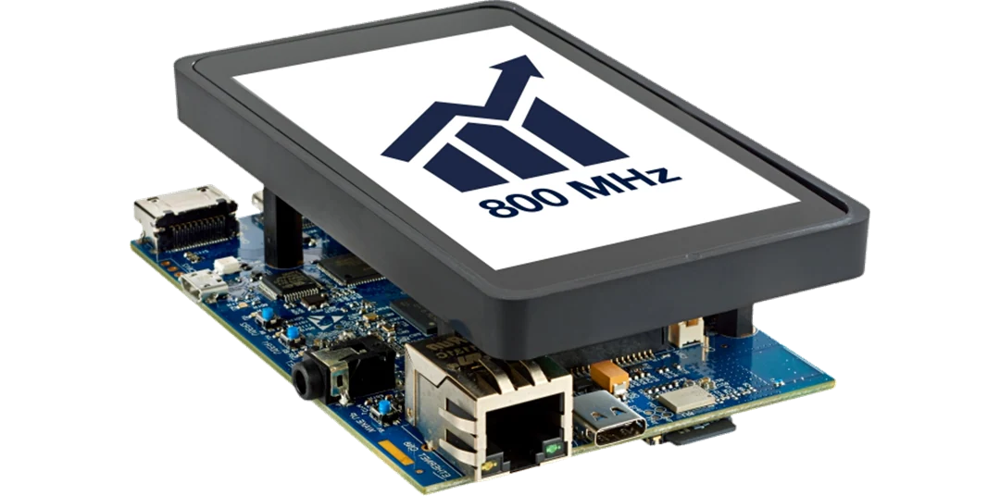

<div id="top"></div>
<!--
*** Thanks for checking out the Best-README-Template. If you have a suggestion
*** that would make this better, please fork the repo and create a pull request
*** or simply open an issue with the tag "enhancement".
*** Don't forget to give the project a star!
*** Thanks again! Now go create something AMAZING! :D
-->


<!-- PROJECT SHIELDS -->
<!--
*** I'm using markdown "reference style" links for readability.
*** Reference links are enclosed in brackets [ ] instead of parentheses ( ).
*** See the bottom of this document for the declaration of the reference variables
*** for contributors-url, forks-url, etc. This is an optional, concise syntax you may use.
*** https://www.markdownguide.org/basic-syntax/#reference-style-links
-->
<!--
[![Contributors][contributors-shield]][contributors-url]
[![Forks][forks-shield]][forks-url]
[![Stargazers][stars-shield]][stars-url]
[![Issues][issues-shield]][issues-url]
[![MIT License][license-shield]][license-url]
[![LinkedIn][linkedin-shield]][linkedin-url]
-->


<!-- PROJECT LOGO -->
<br />
<div align="center">
  <a href="https://github.com/SoC-Arch-polito/stmp_iot_ipc_23">
    
  </a>

<h3 align="center">Energy-efficient MQTT sensor node</h3>

  <p align="center">
    Sensor node that exploits the multi-processor architecture of the STM32MP157F-DK2 board to filter the harvested data and transmit them via the MQTT.
    <br />
    <a href="https://github.com/SoC-Arch-polito/stmp_iot_ipc_23/report.pdf"><strong>Explore the docs »</strong></a>
    <br />
    <br />
    <a href="https://github.com/SoC-Arch-polito/stmp_iot_ipc_23">View Demo</a>
    ·
    <a href="https://github.com/SoC-Arch-polito/stmp_iot_ipc_23/issues">Report Bug</a>
    ·
    <a href="https://github.com/SoC-Arch-polito/stmp_iot_ipc_23/issues">Request Feature</a>
  </p>
</div>


<!-- TABLE OF CONTENTS -->
<details>
  <summary>Table of Contents</summary>
  <ol>
    <li>
      <a href="#about-the-project">About The Project</a>
      <ul>
        <li><a href="#functional-specification">Functional Specification</a></li>
      </ul>
    </li>
    <li>
      <a href="#getting-started">Getting Started</a>
      <ul>
        <li><a href="#prerequisites">Prerequisites</a></li>
        <li><a href="#installation">Installation</a></li>
      </ul>
    </li>
    <li><a href="#usage">Usage</a></li>
    <!--<li><a href="#roadmap">Roadmap</a></li>-->
    <li><a href="#contributing">Contributing</a></li>
    <li><a href="#license">License</a></li>
    <li><a href="#authors">Authors</a></li>
    <!--<li><a href="#acknowledgments">Acknowledgments</a></li>-->
  </ol>
</details>


<!-- ABOUT THE PROJECT -->
## About The Project

The application has been developed for the System-on-Chip Architecture course (M.Sc. in Computer Engineering, Embedded Systems – Polytechnic University of Turin).

<!--
### Built With

<p align="right">(<a href="#top">back to top</a>)</p>
-->

### Functional Specification

The developed sensor node aims to provide a scalable and highly customizable structure for a complete data acquisition chain, where the data are moved from edge sensors to remote user clients through the network. Even though the data exchange and the user-configurable filtering are implemented, the product lacks all the fine-grained optimizations that would make it fit for immediate deployment. However, its structure and protocols make it extensible and configurable for every kind of specific task or real-time constraint. 

   
<p align="right">(<a href="#top">back to top</a>)</p>

<!-- GETTING STARTED -->
## Getting Started

The board used to develop the sensor node is the **STMicroelectronics STM32MP157F-DK2** board.  
Some of its key features are: 

- The powerful **STM32MP157 chip:**
  - Dual Cortex-A7 800 MHz 32-bit processor
  - Cortex-M4 32-bit co-processor
- A CA7 MPU that can run an embedded version of Linux.
- A CM4 MCU that runs STM32CubeMP1 firmware.
- Ethernet ports and WiFi adapters to access the Internet.
- Two ADCs with Analog Watchdogs to roughly filter the input signals
- Hardware and software integration for MCU-MPU Inter-Processor Communication   


### Prerequisites

To start working with the board the first step is to gather all the software necessary to work with the board.
List of tools to be used for the Cortex-A7:

  - [STM32MP1 OpenSTLinux Starter Package](https://www.st.com/en/embedded-software/stm32mp1starter.html): The OpenSTLinux OS is a custom Linux distribution provided by STM.

  - [STM32CubeProgrammer](https://www.st.com/en/development-tools/stm32cubeprog.htmll): The STM32CubeProgrammer Software is used to program STM32 internal (e.g. Flash, RAM and OTP) and external memories. In our case, it is exploited to flash the OS into a microSD that is going to be mounted on the board.

List of tools to be used for the Cortex-M4:

  - [STM32CubeIDE](https://www.st.com/en/development-tools/stm32cubeide.html): Advanced C/C++ development platform with peripheral configuration, code generation and compilation, and debug features for STM32 microcontrollers and microprocessors. It is needed to write, compile and flash the firmware the M4 core.

  - [STM32MP1Cube](https://www.st.com/en/embedded-software/stm32cubemp1.html): Provides the source code of BSP, HAL drivers, middleware components and application packages for development on Arm® Cortex®-M processors.

### Installation <a name="installation"></a>

1. Start by following the [guide](https://wiki.st.com/stm32mpu/wiki/Getting_started/STM32MP1_boards/STM32MP157x-DK2/Let%27s_start/Populate_the_target_and_boot_the_image) to flash and use OpenSTLinux on the A7 microprocessor.

2. Once you have OpenSTLinux running on the A7 and you are able to excecute commands through the serial terminal, install the Python software required by the application. The libraries are listed inside `src/requirements.txt` and can be installed with the following command:  
    ```sh
    python3 -m pip install --trusted-host pypi.org --trusted-host files.pythonhosted.org pipreqs -r /path/to/requirements.txt
    ```
    Among the used libraries one of the most important is [Paho-MQTT](https://pypi.org/project/paho-mqtt/).

3. The next step is to get more comfortable with the M4 microcontroller. Use the appropriate [guide](https://wiki.st.com/stm32mpu/wiki/Getting_started/STM32MP1_boards/STM32MP157x-DK2/Develop_on_Arm%C2%AE_Cortex%C2%AE-M4/Modify,_rebuild_and_reload_a_firmware) to start playing with the firmware deployment using STM32CubeIDE.

4. Now you can clone the repository on your PC:
   ```sh
   git clone https://github.com/SoC-Arch-polito/stmp_iot_ipc_23
   ```
    To move on the board the files that will run there, you can use the `scp` command. 

5. Always on your PC, create a new STM32CubeIDE project by importing the one present in `src/OpenAMP_TTY_echo_wakeup_AWD` and build the firmware.  
At this point create the directory `/home/root/OpenAMP_TTY_echo_wakeup_CM4/lib/firmware/` and move the *elf* file in `OpenAMP_TTY_echo_wakeup_CM4/Debug/` inside it.  
The firmware executable must have the same name of the parent directory of `lib/` because the file used to automatically flash the M4 at the startup of the kernel (`fw_cortex_m4.sh`) extracts supposed that the firmware name is the same of the mentioned directory.

6. After creating the directories `interface/` and `scripts/` inside `/home/root` you can complete the setup of the board by moving the files inside `src/` like suggested below:
    - `board_interface/`
    
      - `ipcc-interface_noSusp.service.py` into `interface/`

      - `board_header.py` into `interface/`
    
    - `systemd_services/setup_scripts`

      - `comm_setup.sh` into `scripts/`

      - `setup.sh` into `scripts/`

    Finally you can add the Systemd services inside `systemd_services/` into `/etc/systemd/system/`.  
    Now you have to enable them with the command:
    ```sh
    systemctl enable <service name>
    ```

5. At this point you can install a specific MQTT broker or use a public one (e.g. [HiveMQ](https://www.hivemq.com/mqtt/public-mqtt-broker/)). In case you chose the first option, a possible suggestion is the [Mosquitto MQTT broker](https://mosquitto.org/). During the development, we installed it on our PC but it can virtually run on every node that is part of the application network.  
   ```sh
   sudo apt-get install mosquitto 
   ```
   After the installation and make sure that Mosquitto can run correctly with the `mosquitto` command. To make the it work with the application, you will need to modify the configuration file located under `/etc/mosquitto/mosquitto.conf`. Different options such as authentication, port numbers, and persistence can be edited.  
   For our specific case, you will need to add the following lines:
   ```sh
   listener 1883 
   allow_anonymous true
   ```
    This is needed to allow connections on the default MQTT port (1883) from any network interface, so it can be possible to interact with external clients.  
    In case you didn't want to tinker with the default configuration file, a custom one is provided in `src/mosquitto.conf`.  
    The following command loads the custom configuration file when Mosquitto is launched:
    ```sh
    mosquitto -c /path/to/custom/mosquitto.conf
    ``` 

Additional details on the installation of the application can be found inside `report.pdf`.
<p align="right">(<a href="#top">back to top</a>)</p>


<!-- USAGE EXAMPLES -->
## Usage

Supposing you have followed all the [Installation](#installation) steps, you can now proceed to use the application.  
In case of errors during the execution, it is suggested to read `report.pdf` to better understand the cause of the problem.

1. Run the MQTT broker if you installed it on one of your devices.

2. Start the user client `src/mqtt_clients/client_noSusp.py`.

3. Connect the board to the PC, open the STM32CubeIDE project, open a *console* window and click on it.

4. Power-on the board and select the `stm32mp157f-dk2-m4-examples` boot mode as explained in the [guide](https://wiki.st.com/stm32mpu/wiki/STM32CubeMP15_Package_-_Getting_started#Select_boot_mode_for_M4_examples).

5. Wait some time and then check that the application service is correctly running with:
    ```sh
    systemctl status app_interface
    ```
   It is also suggested to control the CM4 log `/sys/kernel/debug/remoteproc/remoteproc0/trace0`.

6. If the application has no issue you start by verifying that the threshold update procedure works. At the moment the M4 cannot retrieve any out-of-window data becasue the ADC resolution is set to 12 bits and the AWD window is (0,4095). Try to set (500,2500) as new threshold by following the instructions on the user client terminal. The initial DAC output is configured to 2048 so it is not advised to use a window that does not include this value.   
    What to do next depends on the exit status of the operation:
    - *FINISHED*: the threshold update has been completed successfully so you can move on.   
    - *ABORTED*: there has been a problem so you should check the log files `log/status.txt` and `log/error.txt`.
    In both cases it is suggested to check the CM4 log to verify if the threshold has been changed.  


7. You can press the *USER1* button on the board to change the DAC output value in the following order 0 -> 1023 -> 2048 -> 3071 -> 4095 -> 0 -> ... .  
    If the threshold has been set to (500,2500), the file `log/data.txt` should be suddenly populated. It is advised to press again the button after a few seconds because the ADC is fed with a constant value so the number of received data grows very fast.

Now that all the basic sensor node functionalities have been explored you can start to modify it in order to adapt it to your needs. The complete documentation, together with many suggestions on how to improve the application and solve some errors of the current version can be found inside `report.pdf`.
<p align="right">(<a href="#top">back to top</a>)</p>


<!-- ROADMAP -->
<!--
## Roadmap

- [] Feature 1
- [] Feature 2
- [] Feature 3
    - [] Nested Feature

See the [open issues](https://github.com/github_username/repo_name/issues) for a full list of proposed features (and known issues).

<p align="right">(<a href="#top">back to top</a>)</p>
-->


<!-- CONTRIBUTING -->
## Contributing

Contributions are what make the open source community such an amazing place to learn, inspire, and create. Any contributions you make are **greatly appreciated**.

If you have a suggestion that would make this better, please fork the repo and create a pull request. You can also simply open an issue with the tag "enhancement".
Don't forget to give the project a star! Thanks again!

1. Fork the Project
2. Create your Feature Branch (`git checkout -b feature/AmazingFeature`)
3. Commit your Changes (`git commit -m 'Add some AmazingFeature'`)
4. Push to the Branch (`git push origin feature/AmazingFeature`)
5. Open a Pull Request

<p align="right">(<a href="#top">back to top</a>)</p>


<!-- LICENSE -->
## License

Distributed under the BSD 3-Clause License. See `LICENSE.txt` for more information.

<p align="right">(<a href="#top">back to top</a>)</p>


<!-- ACKNOWLEDGMENTS -->
## Authors

* **Matteo Fragassi**: [Github](https://github.com/Matth9814), [LinkedIn](https://linkedin.com/in/matteo-fragassi-06a19b241)
* **Davide Giuffrida**: [Github](https://github.com/Davide-Giuffrida), [LinkedIn](https://www.linkedin.com/in/davide-giuffrida-55959a267/)
* **Massimiliano di Todaro**: [Github](https://github.com/mditodaro), [LinkedIn](http://linkedin.com/in/massimiliano-di-todaro-bb4872233)
* **Balint Bujtor**: [Github](https://github.com/balintbujtor), [LinkedIn](http://linkedin.com/in/balint-bujtor)

<p align="right">(<a href="#top">back to top</a>)</p>


<!-- MARKDOWN LINKS & IMAGES -->
<!-- https://www.markdownguide.org/basic-syntax/#reference-style-links -->
[contributors-shield]: https://img.shields.io/github/contributors/github_username/repo_name.svg?style=for-the-badge
[contributors-url]: https://github.com/github_username/repo_name/graphs/contributors
[forks-shield]: https://img.shields.io/github/forks/github_username/repo_name.svg?style=for-the-badge
[forks-url]: https://github.com/github_username/repo_name/network/members
[stars-shield]: https://img.shields.io/github/stars/github_username/repo_name.svg?style=for-the-badge
[stars-url]: https://github.com/github_username/repo_name/stargazers
[issues-shield]: https://img.shields.io/github/issues/github_username/repo_name.svg?style=for-the-badge
[issues-url]: https://github.com/github_username/repo_name/issues
[license-shield]: https://img.shields.io/github/license/github_username/repo_name.svg?style=for-the-badge
[license-url]: https://github.com/github_username/repo_name/blob/master/LICENSE.txt
[linkedin-shield]: https://img.shields.io/badge/-LinkedIn-black.svg?style=for-the-badge&logo=linkedin&colorB=555
[linkedin-url]: https://linkedin.com/in/linkedin_username
[product-screenshot]: images/screenshot.png
